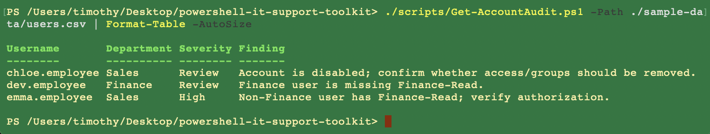

# Get-AccountAudit

[Back to docs](README.md) · [Architecture](architecture.md)

[`scripts/Get-AccountAudit.ps1`](../scripts/Get-AccountAudit.ps1) reads a CSV and emits findings. It does not disable accounts or change groups.

Input is [`sample-data/users.csv`](../sample-data/users.csv) — five synthetic rows used to prove the rules fire.

```csv
Username,Department,Enabled,Groups
alice.employee,Finance,true,VPN-Users;Finance-Read
ben.employee,IT,true,Helpdesk;VPN-Users
chloe.employee,Sales,false,VPN-Users
dev.employee,Finance,true,VPN-Users
emma.employee,Sales,true,Finance-Read
```

## Usage

```powershell
./scripts/Get-AccountAudit.ps1 -Path ./sample-data/users.csv | Format-Table -AutoSize
```

`-Path` is required. Missing file throws.

## Rules

`Enabled` is treated as true when the cell matches `true`, `yes`, or `1` (case-insensitive). Groups are semicolon-separated.

| Condition | Severity | Finding |
| --- | --- | --- |
| Account not enabled | Review | Disabled; confirm leftover access/groups |
| Department `Finance` and group list lacks `Finance-Read` | Review | Finance user missing `Finance-Read` |
| Department is not `Finance` and group list contains `Finance-Read` | High | Non-Finance user has `Finance-Read` |
| No groups at all | Review | Empty group list |

One user can produce multiple rows. Clean accounts produce nothing — alice and ben are the negative controls.

## Evidence

Three planted issues come back from the sample file:

| Username | Why it fires |
| --- | --- |
| `chloe.employee` | Disabled Sales account still listed with `VPN-Users` |
| `dev.employee` | Finance, missing `Finance-Read` |
| `emma.employee` | Sales with `Finance-Read` (High) |



The [smoke test](../.github/workflows/powershell-smoke-test.yml) runs this script on the same CSV and fails if it gets fewer than three findings. Parse-check the other scripts; this is the only functional assertion in CI, because the HTTP checks need localhost services the runner does not have.
