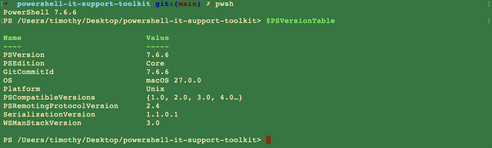

# Getting started

[Back to docs](README.md) · [Architecture](architecture.md)

## Runtime

The scripts target **PowerShell 7** (`pwsh`), not Windows PowerShell 5.1. Core scripts avoid Windows-only cmdlets.



## Setup

1. Install [PowerShell 7](https://learn.microsoft.com/powershell/scripting/install/installing-powershell-on-macos).
2. Clone this repo and `cd` into it.
3. Copy the example service list. `config/services.json` is gitignored so local URLs never get committed:

```bash
cp config/services.example.json config/services.json
```

4. Keep [sample-data/users.csv](../sample-data/users.csv) as-is for the account-audit demo. It is synthetic.

The example config points at local Project 1 / Project 2 endpoints plus the public Azure Static Web App:

```json
[
  {"Name":"osTicket","Url":"http://localhost:8080"},
  {"Name":"LLDAP","Url":"http://localhost:17170"},
  {"Name":"Uptime Kuma","Url":"http://localhost:3001"},
  {"Name":"Azure Portfolio","Url":"https://orange-plant-0676ffb00.3.azurestaticapps.net"}
]
```

If those processes are not running, [Test-ServiceHealth](service-health.md) will report `DOWN`. That is expected, not a script bug.

## Run the scripts

```powershell
pwsh

./scripts/Test-NetworkPath.ps1 -Target orange-plant-0676ffb00.3.azurestaticapps.net -Port 443 | Format-List

./scripts/Test-ServiceHealth.ps1 -ConfigPath ./config/services.json | Format-Table -AutoSize

./scripts/Get-AccountAudit.ps1 -Path ./sample-data/users.csv | Format-Table -AutoSize
```

See [network path](network-path.md), [service health](service-health.md), and [account audit](account-audit.md) for parameters and captured output.

`Test-ServiceHealth.ps1` writes a timestamped CSV under `reports/` unless you pass `-NoExport`. Those files are gitignored.

## CI

[`.github/workflows/powershell-smoke-test.yml`](../.github/workflows/powershell-smoke-test.yml) runs on push to `main`, pull requests, and `workflow_dispatch`:

1. Parse every `scripts/*.ps1` with the PowerShell AST parser.
2. Run `Get-AccountAudit.ps1` against `sample-data/users.csv` and fail if fewer than three deliberate findings come back.

It does **not** hit localhost HTTP services. A GitHub runner cannot see your osTicket container, and the workflow is not pretending otherwise.
