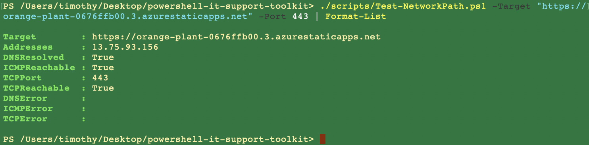

# Test-NetworkPath

[Back to docs](README.md) · [Architecture](architecture.md)

[`scripts/Test-NetworkPath.ps1`](../scripts/Test-NetworkPath.ps1) answers three questions for one host: did DNS resolve, does ICMP respond, can this TCP port be opened.

That split matters. DNS success with a TCP timeout is a different ticket from “name does not exist.”

## Usage

```powershell
./scripts/Test-NetworkPath.ps1 -Target <hostname> [-Port 443] [-TimeoutSeconds 5] | Format-List
```

| Parameter | Default | Notes |
| --- | --- | --- |
| `-Target` | required | Hostname or address. Prefer a name, not a full URL. |
| `-Port` | `443` | TCP port, 1–65535 |
| `-TimeoutSeconds` | `5` | TCP connect wait, 1–30 |

The script returns one object:

| Property | Meaning |
| --- | --- |
| `Addresses` | Resolved IPs, comma-joined |
| `DNSResolved` | At least one address from `GetHostAddresses` |
| `ICMPReachable` | `Test-Connection -Count 2 -Quiet` |
| `TCPReachable` | `TcpClient.ConnectAsync` completed and connected |
| `DNSError` / `ICMPError` / `TCPError` | Exception or timeout text when a check fails |

ICMP failure on a host that still accepts TCP is common. Firewalls drop ping. Treat `ICMPReachable` as a hint, not a verdict.

## Evidence

Successful path check against the Azure Static Web App (port 443): DNS `True`, ICMP `True`, TCP `True`, address `13.75.93.156`.


