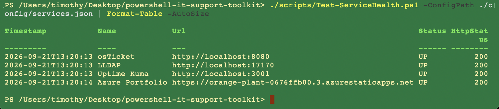
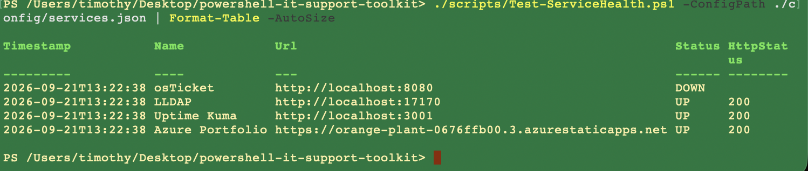
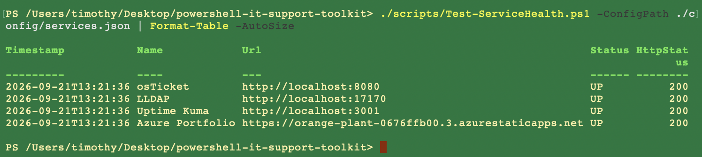

# Test-ServiceHealth

[Back to docs](README.md) · [Architecture](architecture.md) · [Getting started](getting-started.md)

[`scripts/Test-ServiceHealth.ps1`](../scripts/Test-ServiceHealth.ps1) GETs each URL in the local service list and classifies the result. It is a snapshot, not a monitor. Uptime Kuma still owns continuous checks.

## Usage

```powershell
./scripts/Test-ServiceHealth.ps1 [-ConfigPath ./config/services.json] [-ReportDirectory ./reports] [-NoExport] | Format-Table -AutoSize
```

Copy [`config/services.example.json`](../config/services.example.json) to `config/services.json` first. The live file is gitignored.

| Parameter | Default | Notes |
| --- | --- | --- |
| `-ConfigPath` | `./config/services.json` | JSON array of `{ Name, Url }` |
| `-ReportDirectory` | `./reports` | Timestamped CSV unless `-NoExport` |
| `-NoExport` | off | Skip the CSV write |

Status rules:

| Status | When |
| --- | --- |
| `UP` | HTTP 200–399 |
| `DEGRADED` | HTTP response outside 200–399 |
| `DOWN` | Request threw (connection refused, timeout, DNS, TLS, and so on) |

Each row includes `Timestamp`, `Name`, `Url`, `Status`, `HttpStatus`, `ResponseMs`, and `Error`.

## Evidence: all up

osTicket, LLDAP, Uptime Kuma, and the Azure portfolio all returned HTTP 200.



## Evidence: osTicket down

Same config, osTicket stopped. The script marks that row `DOWN` and leaves the other three `UP`. That is the point of per-service objects instead of a single boolean.



## Evidence: recovered

osTicket back, all four `UP` again.



These runs do not restart anything. Bring the process back yourself, then re-run the check.
